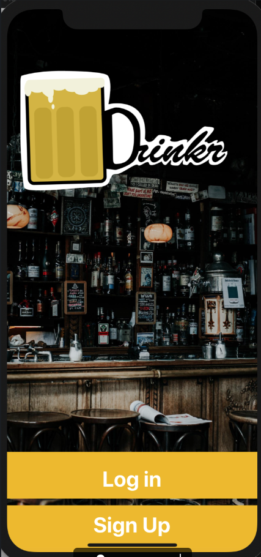
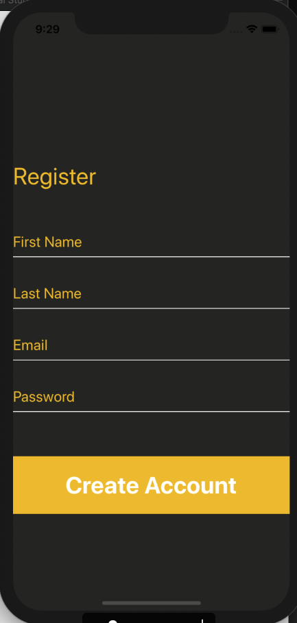
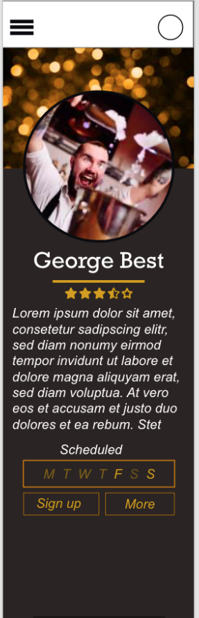
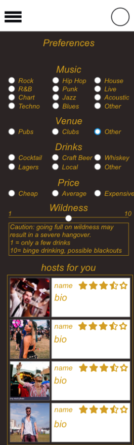

## Soical Mobile Application

A native-app that allows users to create a profile and filters events to their style. Plug in your preferences to customisable fields and the app will display hosts, venues, location and budget.

   

### Built With
* [Java](https://www.java.com/en/)
* [React Native](https://reactnative.dev/)
* [Expo](https://expo.io/)
* [Spring Boot](https://spring.io/projects/spring-boot)
* [Spring Data](https://spring.io/projects/spring-data)

### Back-End Repository https://github.com/atrp87/Back_End_Group_Project

